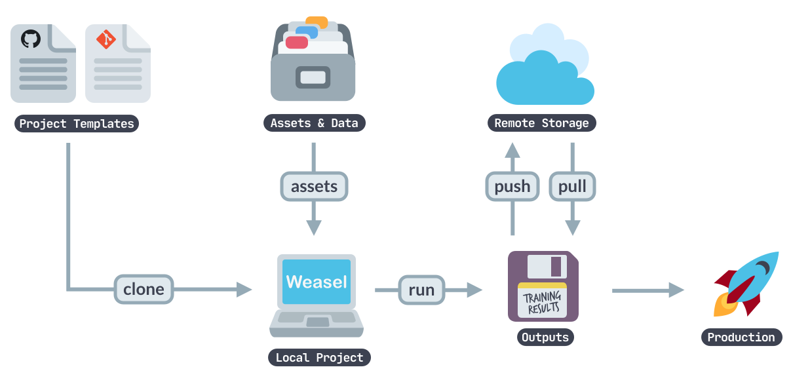

<a href="https://explosion.ai"></a>

# Weasel: A small and easy workflow system

Weasel lets you manage and share **end-to-end workflows** for
different **use cases and domains**, and orchestrate training, packaging and
serving your custom pipelines. You can start off by cloning a pre-defined
project template, adjust it to fit your needs, load in your data, train a
pipeline, export it as a Python package, upload your outputs to a remote storage
and share your results with your team. Weasel can be used via the
[`weasel`](docs/cli.md) command and we provide templates in our
[`projects`](https://github.com/explosion/projects) repo.



## :bulb: Example: Get started with a project template

The easiest way to get started is to clone a project template and run it – for
example, this [end-to-end template](https://github.com/explosion/projects/tree/v3/pipelines/tagger_parser_ud)
that lets you train a spaCy **part-of-speech
tagger** and **dependency parser** on a Universal Dependencies treebank.

```shell
python -m weasel clone pipelines/tagger_parser_ud
```

> **Note**
>
> Our [`projects`](https://github.com/explosion/projects) repo includes various
> project templates for different NLP tasks, models, workflows and integrations
> that you can clone and run. The easiest way to get started is to pick a
> template, clone it and start modifying it!

## :closed_book: Documentation

Get started with the documentation:

- [Learn how to create a Weasel workflow](docs/tutorial/workflow.md)
- [Working with directory and assets](docs/tutorial/directory-and-assets.md)
- [Running custom scripts](docs/tutorial/custom-scripts.md)
- [Using remote storage](docs/tutorial/remote-storage.md)
- [Weasel integrations](docs/tutorial/integrations.md)
- [Command line interface description](docs/cli.md)

## Migrating from spaCy Projects

Weasel is a standalone replacement for spaCy Projects.
There are a few backward incompatibilities that you should be aware of:

- The `SPACY_CONFIG_OVERRIDES` environment variable is no longer checked.
  You can set configuration overrides using `WEASEL_CONFIG_OVERRIDES`.
- Support for the `spacy_version` configuration key has been dropped.
- Support for `SPACY_PROJECT_USE_GIT_VERSION` environment variable has been dropped.
- Error codes are now Weasel-specific, and do not follow spaCy error codes.

Weasel checks for the first three incompatibilities and will issue a
warning if you're using it with spaCy-specific configuration options.
