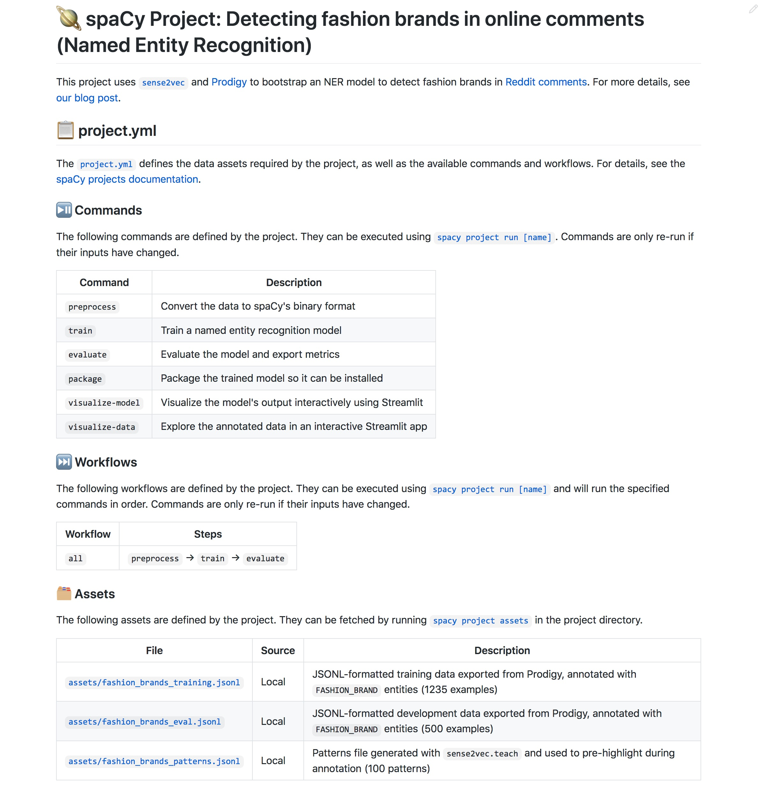

# Custom scripts and projects

The `project.yml` lets you define any custom commands and run them as part of
your training, evaluation or deployment workflows. The `script` section defines
a list of commands that are called in a subprocess, in order. This lets you
execute other Python scripts or command-line tools.

Let's say you're training a spaCy pipeline, and you've written a
few integration tests that load the best model produced by the training command
and check that it works correctly. You can now define a `test` command that
calls into [`pytest`](https://docs.pytest.org/en/latest/), runs your tests and
uses [`pytest-html`](https://github.com/pytest-dev/pytest-html) to export a test
report:

> :bulb: **Example configuration**
>
> ```yaml title="project.yml"
> commands:
>   - name: test
>     help: 'Test the trained pipeline'
>     script:
>       - 'pip install pytest pytest-html'
>       - 'python -m pytest ./scripts/tests --html=metrics/test-report.html'
>     deps:
>       - 'training/model-best'
>     outputs:
>       - 'metrics/test-report.html'
>     no_skip: true
> ```

Adding `training/model-best` to the command's `deps` lets you ensure that the
file is available. If not, Weasel will show an error and the command won't run.
Setting `no_skip: true` means that the command will always run, even if the
dependencies (the trained pipeline) haven't changed. This makes sense here,
because you typically don't want to skip your tests.

## Writing custom scripts

Your project commands can include any custom scripts – essentially, anything you
can run from the command line. Here's an example of a custom script that uses
[`typer`](https://typer.tiangolo.com/) for quick and easy command-line arguments
that you can define via your `project.yml`:

```python title="scripts/custom_evaluation.py"
import typer

def custom_evaluation(batch_size: int = 128, model_path: str, data_path: str):
    # The arguments are now available as positional CLI arguments
    print(batch_size, model_path, data_path)

if __name__ == "__main__":
    typer.run(custom_evaluation)
```

> :information_source: **About Typer**
>
> [`typer`](https://typer.tiangolo.com/) is a modern library for building Python
> CLIs using type hints. It's a dependency of spaCy, so it will already be
> pre-installed in your environment. Function arguments automatically become
> positional CLI arguments and using Python type hints, you can define the value
> types. For instance, `batch_size: int` means that the value provided via the
> command line is converted to an integer.

In your `project.yml`, you can then run the script by calling
`python scripts/custom_evaluation.py` with the function arguments. You can also
use the `vars` section to define reusable variables that will be substituted in
commands, paths and URLs. In the following example, the batch size is defined as a
variable will be added in place of `${vars.batch_size}` in the script.

> :bulb: **Example usage of `vars`**
>
> ```yaml title="project.yml"
> vars:
>  batch_size: 128
>
> commands:
>   - name: evaluate
>     script:
>       - 'python scripts/custom_evaluation.py ${vars.batch_size} ./training/model-best ./corpus/eval.json'
>     deps:
>       - 'training/model-best'
>       - 'corpus/eval.json'
> ```

> :information_source: **Calling into Python**
>
> If any of your command scripts call into `python`, spaCy will take care of
> replacing that with your `sys.executable`, to make sure you're executing
> everything with the same Python (not some other Python installed on your
> system). It also normalizes references to `python3`, `pip3` and `pip`.

You can also use the `env` section to reference **environment variables** and
make their values available to the commands. This can be useful for overriding
settings on the command line and passing through system-level settings.

> :bulb: **Example usage of EnvVars**
>
> ```bash
> export GPU_ID=1
> BATCH_SIZE=128 python -m weasel run evaluate
> ```
>
> ```yaml title="project.yml"
> env:
>   batch_size: BATCH_SIZE
>   gpu_id: GPU_ID
>
> commands:
>   - name: evaluate
>     script:
>       - 'python scripts/custom_evaluation.py ${env.batch_size}'
> ```

## Documenting your project

> :bulb: **Examples**
>
> For more examples, see the [`projects`](https://github.com/explosion/projects)
> repo.
>
> 

When your custom project is ready and you want to share it with others, you can
use the [`weasel document`](../cli.md#document) command to
**auto-generate** a pretty, Markdown-formatted `README` file based on your
project's `project.yml`. It will list all commands, workflows and assets defined
in the project and include details on how to run the project, as well as links
to the relevant spaCy documentation to make it easy for others to get started
using your project.

```bash
python -m weasel document --output README.md
```

Under the hood, hidden markers are added to identify where the auto-generated
content starts and ends. This means that you can add your own custom content
before or after it and re-running the `document` command will **only
update the auto-generated part**. This makes it easy to keep your documentation
up to date.

> **Warning**
>
> Note that the contents of an existing file will be **replaced** if no existing
> auto-generated docs are found. If you want spaCy to ignore a file and not update
> it, you can add the comment marker `{/* WEASEL: IGNORE */}` anywhere in
> your markup.

## Cloning from your own repo

The [`weasel clone`](../cli.md#clone) command lets you customize
the repo to clone from using the `--repo` option. It calls into `git`, so you'll
be able to clone from any repo that you have access to, including private repos.

```bash
python -m weasel clone your_project --repo https://github.com/you/repo
```

At a minimum, a valid project template needs to contain a
[`project.yml`](./directory-and-assets.md#projectyml). It can also include
[other files](./directory-and-assets.md), like custom scripts, a
`requirements.txt` listing additional dependencies,
a machine learning model and meta templates, or Jupyter
notebooks with usage examples.

> :warning: **Important note about assets**
>
> It's typically not a good idea to check large data assets, trained pipelines or
> other artifacts into a Git repo and you should exclude them from your project
> template by adding a `.gitignore`. If you want to version your data and models,
> check out [Data Version Control](./integrations.md#data-version-control-dvc) (DVC), which integrates with spaCy
> projects.
